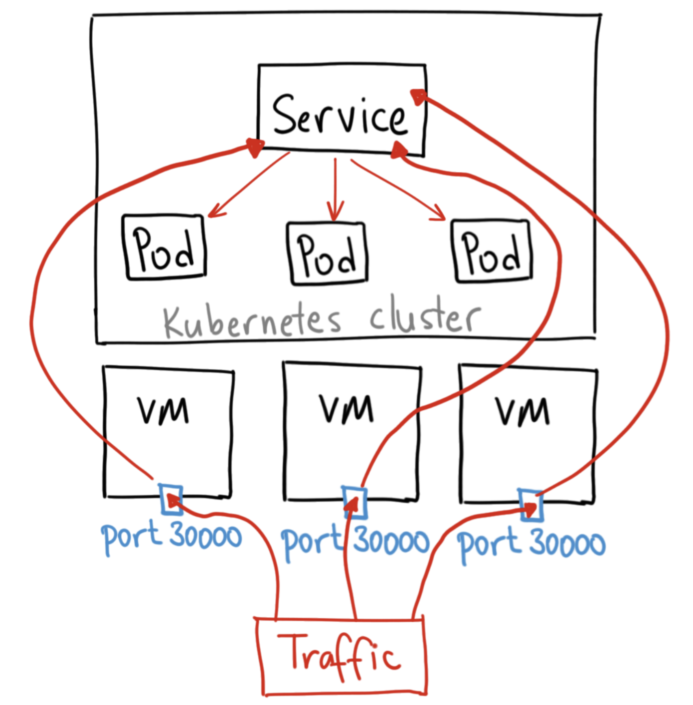
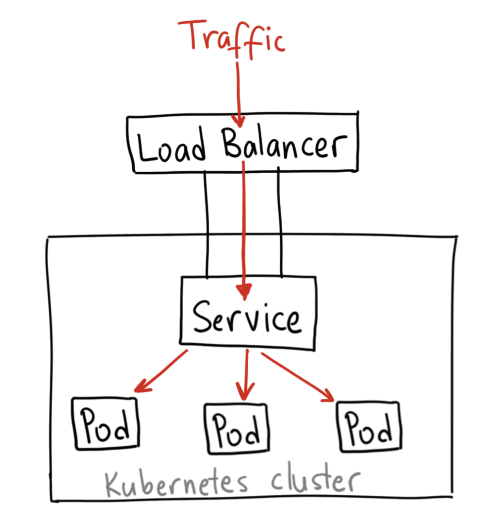

Spring Boot Zuul - Eureka - Kubernetes 
------------------------------------------
This example demonstrates the main features of the Zuul API gateway integrated into spring cloud : 
•	Service auto registration via eureka 
•	Service registration by address 
•	Service registration by service ID 
•	Filters (logging, authentication) 
•	Serving static content 
•	Service response Aggregation through Zuul  
Technology Used:  
•	Spring boot 1.5.3.RELEASE 
•	Eureka Service Discovery Client 
•	Zuul API Gateway  

## Project Contents

This project contains 4 modules, where each one has it own configuration for deployment:
- **Eureka-Server:** It's the main eureka server, this is the service discovery application, all the other services will register with that
server. For deploying it in Kubernetes be sure that you have a very stable network environment, so this module will use a k8s statefulset.
- **Account-Service:** This is a simple Spring Boot REST service, that will connect to Eureka Server enabling another
services to communicate and reach this service.
- **Zuul-Server:** Zuul is the api gateway that can be used either as a load balancer, ou a gateway to distribute traffic to your 
services. For securities best practices, the best way in disposing microservices, is exposing only the gateway
to the client, to control the traffic and network distribution. Also, you can use Zuul as an authentication method, applying filters and 
another credentials mechanisms.
- **Feign-Service:** This is another simple Spring Boot REST service, but to show the communication between services, so if you do a HTTP GET request
to */node/feign*, it will call a method from account-service.

## Environments

Currently there is the dev and prod profiles, the dev is for running everything in localhost, better with an IDE like IntelliJ Idea. The
prod profile it's to deploying it on Kubernetes.

### Deploying to Kubernetes

For deploying to kubernetes, each module has a Dockerfile for creating a docker image. So, for each service the commands for
building the image is:

- ***Account-Service:*** docker build -t <docker-hub-username>/account-service:latest .
- ***Zuul-Server:*** docker build -t <docker-hub-username>/zuul-server:latest .
- ***Eureka-Server:*** docker build -t <docker-hub-username>/eureka-server:latest .
- ***Feign-Service:*** docker build -t <docker-hub-username>/feign-service:latest .

After you build the image, you can push it with the command: docker push <docker-hub-username>/<service-name>

In the deployment.yml file, which is used for creating the deployment and service in Kubernetes cluster, change the name of the 
pushed docker images. After changing the images names, deploy to kubernetes with command:

kubectl apply -f deployment

-------------------------------------------------------------------------------------------------------------------------------------------------------------------------------------------------------------------
Running Attached Project :

1.	Extract and you can find four maven projects 
2.	Run all the project with mvn install -DskipTests

Access the two micro service through the api gateway zuul-server (http://localhost:9090) : 

http://localhost:9090/api/account-service/account/login

http://localhost:9090/api/node-service/node/1

Service Discovery through the URL :
http://localhost:8761/

## Some points:
* The eureka server application must be deployed in a very stable network environment, and kubernetes statefulset helps us in ensuring stable network, in your kubernetes file, have a section for the service, and another for the statefulset. Also using statefulset, you can set DNS names that points to pods, so you can set them hardcoded to make it easier to put the eureka server url in the client configuration file.
* For security reasons you can set the service of the deployed microservices as NodePort or ClusterIP, instead of LoadBalancer, because we have our gateway that will handle the redirection to the services.

## Kubernetes Services diferences:
* ClusterIP: It’s the default one, giving a service allowing another apps inside the cluster to access it.
* NodePort: The node port opens an specific port in all the nodes (instances), and all the requests on those ports will be redirected to the service, which will redirect to the pods.

* LoadBalancer: It’s the most standard way of exposing a service to the internet. If you are using EKS cluster, when you create a LoadBalancer, this load balancer will be persisted in the AWS console, and it will distribute the traffic to the service, which will reach the pods.

Kubernetes has three Object Types you should know about:
* Pods - runs one or more closely related containers
* Services - sets up networking in a Kubernetes cluster
* Deployment - Maintains a set of identical pods, ensuring that they have the correct config and that the right number of them exist.
Pods:
* Runs a single set of containers
* Good for one-off dev purposes
* Rarely used directly in production
Deployment:
* Runs a set of identical pods
* Monitors the state of each pod, updating as necessary
* Good for dev
* Good for production

---------------------------------------------------------------------------------------------------------------------------------------------------------------------------------------------------------------------
Link followed for design :

http://microservices.io/patterns/microservices.html

https://dzone.com/articles/spring-cloud-netflix-zuul-edge-serverapi-gatewayga

https://www.nginx.com/blog/building-microservices-using-an-api-gateway/
